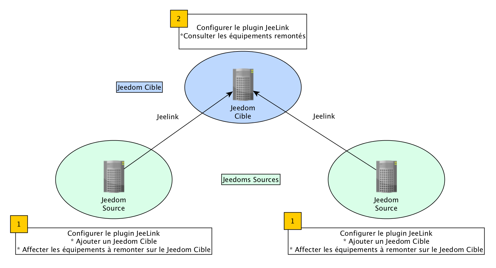
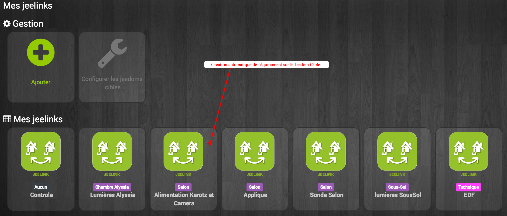

Jeelink 
=======

Description 
-----------

Plugin servant à lier 2 Jeedoms

Principe de fonctionnement 
==========================

Le plugin *Jeedom Link* (aussi appelé jeelink) permet la remontée d’un
ou plusieurs équipement(s) d’un Jeedom sur un autre.

> **Important**
>
> Il faut que le plugin soit installé sur les tous les Jeedoms, Source
> et Cible.

> **Tip**
>
> Pour une bonne compréhension, il est important d’appréhender les
> quelques termes suivants :\
> \
> **Jeedom Source** : serveur Jeedom sur lequel sont présents les
> équipements à remonter sur le **Jeedom Cible**\
> \
> **Jeedom Cible** : serveur Jeedom qui recevra les équipements remontés
> par le(s) **Jeedom(s) Source(s)**\
> Le **Jeedom Cible** centralisera ces équipements et ceux de tous le(s)
> **Jeedom(s) Source(s)** configuré(s).\
> \
> **Affectation**: configuration effectuée côté du**Jeedom Source**
> pour inclure les équipements qui seront remontés sur le **Jeedom
> Cible**

> **Note**
>
> Pour une meilleure lecture et compréhension de ce tutoriel :\
> \
> Les copies d’écran sur fond noir correspondent au **Jeedom Cible**.\
> \
> Les copies d’écran sur fond blanc correspondent au **Jeedom Source**.\

configuración del plugin
=======================

Après installation, il vous suffit d’activer le plugin. Celui-ci ne
nécessite aucune configuration spécifique.

Configuration des Jeedoms Cibles 
================================

A partir du **Jeedom Source**, une fois sur la page du plugin (en allant
sur Gestion des plugins → Communication → Jeedom link), il vous suffit
de cliquer sur "Configurer les Jeedoms Cibles".

Une fenêtre va apparaître et vous pourrez à partir de celle-ci
configurer ou ajouter des **Jeedom(s) Cible(s)**.

Pour ajouter un **Jeedom Cible**, il suffit de donner :

-   Le nom du **Jeedom Cible**.

-   L’adresse IP ou le nom DNS du **Jeedom Cible**.

-   La clé API du **Jeedom Cible**.

-   Indiquer si la communication est interne ou externe (utilisée pour
    le retour d’informations, du **Jeedom Source**vers le**Jeedom
    Cible**). Et sauvegarder la configuration.

> **Important**
>
> Il faut **ABSOLUMENT** que les configurations réseaux de tous les
> Jeedoms (Source et Cible) soient OK sinon le plugin ne fonctionnera
> pas.

Affectation des équipements 
===========================

Après avoir effectué la configuration du **Jeedom Cible** sur votre
**Jeedom Source**, il faut aller dans l’onglet *Affectation* pour
spécifier les équipements à transmettre au **Jeedom Cible**. Toutes les
commandes de l’équipement seront automatiquement créées et configurées
sur le **Jeedom Cible**.

Dans l’onglet *Affectation*, ajouter les équipements que vous désirez
remonter vers le **Jeedom Cible**.

Cliquer sur *Ajouter un équipement* Sélectionner l’objet et l’équipement
à ajouter :

> **Tip**
>
> Attention : les plugins ayant un widget spécifique ne l’auront pas sur
> le **Jeedom Cible** (plugin camera, netatmo, network…​).

> **Important**
>
> La suppression de l’équipement sur la page de configuration des
> **Jeedoms Cibles**ne le supprime pas automatiquement sur le**Jeedom
> Source**, cela est volontaire et non un bug (c’est une sécurité).

Les équipements "Mes jeelinks" 
==============================

Après avoir rafraîchi la page *Mes JeeLinks* du **Jeedom Cible**, vous
devez constater la création automatique de l’équipement :

Comme tout équipement Jeedom, vous pouvez activer/désactiver et afficher
ou non l’équipement, ses commandes,…​ ou changer la catégorie. Mais
aussi

Dans l’onglet *Commandes*, vous accédez à tous les paramètres des
commandes de l’équipement :

Modification du Jeedom Source d’un JeeLink 
------------------------------------------

Les 3 paramètres suivants vous permettent de changer le Jeedom Source,
par exemple lors du remplacement d’un Jeedom sans perdre les données
(historique par exemple). Pour cela, il vous suffit de mettre la
nouvelle adresse et clef API du Jeedom Source et de changer les
identifiants de l’équipement et des commandes (vous les trouverez dans
la configuration avancée de ceux-ci en cliquant sur la roue crantée).

-   adresse du Jeedom Source;

-   API key du Jeedom Source;

-   ID de l’équipement Source et des commandes.

Migration ancien mode Esclave 
-----------------------------

Un tutoriel est disponible,
[ici](https://jeedom.github.io/documentation/howto/fr_FR/jeelink.migration.html)
précisant la procédure à suivre pour effectuer la migration d’un Jeedom
Esclave vers le nouveau mode de fonctionnement Jeedom Link.

FAQ 
---

>**Lors de la suppression d'équipement sur le jeedom source ceux-ci ne sont pas supprimé du jeedom cible**
>
>C'est normalement la synchronisation source/cible ne fait que de la création jamais de suppression
